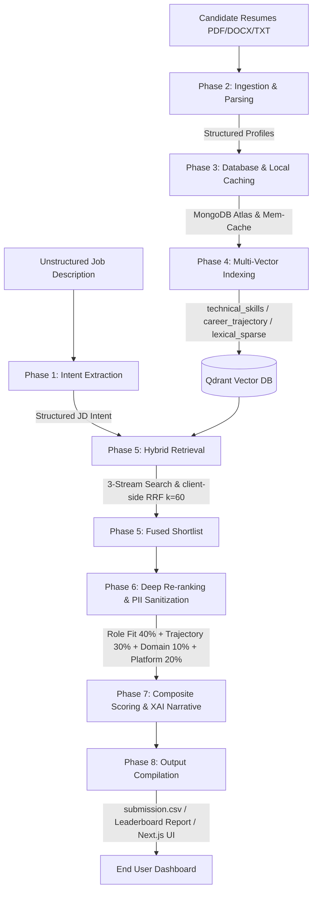

# TalentMatch AI — System Blueprint & Technical Guide

Welcome to the comprehensive system blueprint and architectural handbook for **TalentMatch AI**. This guide provides an in-depth breakdown of the entire platform's inner workings, detailing the role and necessity of every file, the execution mechanics of each feature, and their strategic importance to the overall sourcing ecosystem.

---

## 🌟 Executive Summary

TalentMatch AI is a production-grade, high-performance candidate sourcing, matching, and ranking platform. It uses a state-of-the-art **Two-Stage Retrieval & Re-ranking Architecture** utilizing named multi-vector embedding spaces, lexical sparse representations (SPLADE), Reciprocal Rank Fusion (RRF), and deep LLM-based re-ranking with Explainable AI (XAI) narratives. It enforces strict, demographic-blind (PII-free) evaluation matrices and integrates heuristic filters to automatically defeat honeypot profiles and keyword-stuffing exploits.



---

## 🔄 The 7-Phase Core Pipeline

The application works by feeding unstructured candidate and job information through a sequence of data processing and scoring stages:

1. **Intent Extraction**: The raw, unstructured job description (JD) is analyzed by a LLM parser (prioritizing Groq, then OpenAI, and Gemini) to extract structured requirements (must-have/nice-to-have skills, minimum experience, target domains, and implicit competencies).
2. **Ingestion & Parsing**: Resumes are uploaded through REST endpoints or backend bulk loaders. Text is extracted from PDF, DOCX, or text files, and parsed into a structured Candidate JSON schema.
3. **Database & Caching**: MD5 hashing fingerprints each raw resume. If a resume hash matches an entry in the memory cache, the system skips LLM parsing entirely (short-circuit cache). The raw text is archived in MongoDB Atlas, and the structured profile JSON is persisted.
4. **Multi-Vector Indexing**: The structured candidate profile is converted into three distinct vector layouts and indexed in Qdrant:
   - **`technical_skills`** (dense Cosine vector space) encoding raw technical keywords.
   - **`career_trajectory`** (dense Cosine vector space) encoding the timeline and progression text.
   - **`lexical_sparse`** (SPLADE sparse vector space) capturing precise keyword vertical domains.
5. **Hybrid Retrieval (Stage 1 Search)**: Launches 3 parallel search streams over Qdrant based on the JD intent (Skills stream, Trajectory/Seniority stream, Lexical/SPLADE stream) and fuses their ranked outputs using client-side **Reciprocal Rank Fusion (RRF, k=60)** to shortlist the top 50 candidates.
6. **Deep Re-ranking & PII Sanitization**: Candidate profiles in the shortlist are anonymized (stripping name, email, phone, location, links, etc.) to enforce bias-free evaluation. The system computes a deterministic **Platform Signals** sub-score from platform metrics (GitHub activity, pass rates, profile completeness).
7. **Composite Scoring & XAI**: An LLM evaluates the candidates on the remaining dimensions: **Role Fit (40%)**, **Career Trajectory (30%)**, and **Domain Alignment (10%)**. It then compiles the final composite score alongside structured Explainable AI (XAI) narratives (Strongest Alignment, Competency Gaps, and 3 Tailored Interview Prompts).

---

## 🚀 Key Platform Features & Importance

### 1. Job Intent Extraction
* **How it works**: Uses `JobParserService` to query LLMs with structured prompts and strict schema parameters. It expands high-level vertical tokens (e.g. MERN stack expands into MongoDB, Express, React, Node) to capture implicit skills.
* **Task**: Converts unformatted JDs into highly structured search criteria.
* **Importance**: **Critical (High)**. If the search intent is inaccurate or incomplete, Stage 1 vector retrieval will miss qualified candidates.

### 2. Multi-Vector Ingestion Pipeline & Local Fallback
* **How it works**: Synthesizes three textual representations for skills, career timelines, and domains, and generates dense vector embeddings (using OpenAI or local BAAI fastembed models) and SPLADE sparse embeddings. The Qdrant connection lazily defaults to `:memory:` if no server is configured.
* **Task**: Encodes resumes across three semantic contexts to index them in Qdrant.
* **Importance**: **Critical (High)**. Distinguishing skills from chronological career progression prevents senior/junior candidate matching confusion.

### 3. Hybrid Dual-Space Retrieval (RRF, k=60)
* **How it works**: Executes parallel vector searches over the dense technical, dense trajectory, and sparse SPLADE indices, and fuses results using the Reciprocal Rank Fusion formula:
  $$RRF_{score}(c) = \sum_{m \in M} \frac{1}{k + Rank_m(c)}$$
* **Task**: Combines semantic meaning (dense) with vertical stack terms (sparse) to assemble a high-precision candidate shortlist.
* **Importance**: **High**. Mitigates dense retrieval limitations where semantic proximity matches unrelated stack terms.

### 4. PII Sanitization & Bias-Free Reranking
* **How it works**: Pre-redacts demographic information from the candidate profile payload before sending it to the Stage 2 LLM re-ranker.
* **Task**: Protects candidate data, preventing AI demographic and gender bias.
* **Importance**: **High**. Ensures candidate evaluations remain strictly objective and skill-focused.

### 5. Guarded Heuristic Scoring Engine
* **How it works**: Applies four algorithmic rules directly to candidate metrics:
  - **Experience Envelope**: Grants full points for 5–9 years of experience. Linearly decays scores for less experience, and penalizes by 15% per year for over-qualification (>9 YoE).
  - **Role Title Verification**: Multiplies score by 0.05 if no technical token (e.g., engineer, developer) is present in the title history, neutralizing resume-stuffers.
  - **Behavioral Signal Suppression**: Penalizes profiles with low recruiter response rates (<25%), low test completions (<50%), or stale activity (<2025) to filter out fake profiles.
  - **MD5 Caching**: Avoids duplicate LLM parsing runs by caching files with identical checksums.
* **Task**: Protects the pipeline against keyword stuffing, over-qualification, and inactive accounts.
* **Importance**: **Critical (High)**. Acts as the primary safeguard against automated ranking exploitation.

### 6. Explainable AI (XAI) Generation
* **How it works**: Translates structural profile matches into markdown summaries detailing candidate strengths, skill gaps, and generating three tailored technical interview questions.
* **Task**: Provides hiring teams with transparent reasoning behind each candidate's score.
* **Importance**: **Medium-High**. Simplifies recruiter decision-making by replacing arbitrary percentage scores with readable explanations.

### 7. Asynchronous Pipeline & Server-Sent Events (SSE)
* **How it works**: Celery chains workers to parse, score, enrich, and write outputs asynchronously. FastAPI exposes a StreamingResponse endpoint `/api/v1/pipeline/status/{task_id}` that polls the task and streams progress JSONs.
* **Task**: Handles large resume archives in the background without blocking the API.
* **Importance**: **Medium**. Vital for scaling to large volumes of applicants.

### 8. Synchronous Database Recovery Sync
* **How it works**: Exposes `/api/v1/profiles/sync-recovery` to fetch structured profiles from MongoDB Atlas and re-index them into Qdrant.
* **Task**: Syncs vectors back to Qdrant if the in-memory store is reset.
* **Importance**: **High**. Prevents index desynchronization on backend restarts.

---

## 📂 File-by-File Technical Directory Map

Below is a detailed guide explaining the role and importance of every file and directory in the project.

### 📁 Workspace Root Files

| File Name | Absolute Path | Description / Necessity | Project Importance |
| :--- | :--- | :--- | :--- |
| **`docker-compose.yml`** | [docker-compose.yml](file:///c:/Users/Admin/OneDrive/Desktop/TalentMatch_AI/docker-compose.yml) | Orchestrates container services (FastAPI Backend, Next.js Frontend, MongoDB, Qdrant, Redis, RabbitMQ, and Celery). | **High**: Enables single-command local deployment. |
| **`scaffold_monorepo.py`** | [scaffold_monorepo.py](file:///c:/Users/Admin/OneDrive/Desktop/TalentMatch_AI/scaffold_monorepo.py) | Refactoring script that structured the project into independent backend and frontend folders. | **Medium**: Used to separate systems during initialization. |
| **`seed_factory.py`** | [seed_factory.py](file:///c:/Users/Admin/OneDrive/Desktop/TalentMatch_AI/seed_factory.py) | Generates and uploads 40 mock candidate resumes (representing various career archetypes) to seed the database. | **Medium**: Essential for testing and local database seeding. |
| **`README.md`** | [README.md](file:///c:/Users/Admin/OneDrive/Desktop/TalentMatch_AI/README.md) | High-level developer manual containing setup steps, CLI commands, and setup instructions. | **Medium**: Quick reference documentation. |
| **`ARCHITECTURE.md`** | [ARCHITECTURE.md](file:///c:/Users/Admin/OneDrive/Desktop/TalentMatch_AI/ARCHITECTURE.md) | High-level overview explaining scoring heuristics and tech stack components. | **Medium**: Reference architecture documentation. |

---

### 📁 Backend Component Directory (`/backend`)

The backend codebase is powered by FastAPI, Celery, and Qdrant.

#### ⚙️ Top-Level Scripts & Setup

| File Name | Absolute Path | Description / Necessity | Project Importance |
| :--- | :--- | :--- | :--- |
| **`Dockerfile`** | [Dockerfile](file:///c:/Users/Admin/OneDrive/Desktop/TalentMatch_AI/backend/Dockerfile) | Specifies the Python runtime environment, sets path exports, and configures backend containers. | **High**: Handles backend container builds. |
| **`requirements.txt`** | [requirements.txt](file:///c:/Users/Admin/OneDrive/Desktop/TalentMatch_AI/backend/requirements.txt) | Lists backend dependencies (FastAPI, Qdrant Client, FastEmbed, PyPDF, JWT, Motor, and Celery). | **Critical**: Manages all backend library packages. |
| **`extract_challenge.py`** | [extract_challenge.py](file:///c:/Users/Admin/OneDrive/Desktop/TalentMatch_AI/backend/extract_challenge.py) | Run-harness for the official Hackathon challenge; manages database purging, candidate scoring, and CSV/Leaderboard output. | **High**: Execution script for challenge submissions. |
| **`run_pipeline_check.py`** | [run_pipeline_check.py](file:///c:/Users/Admin/OneDrive/Desktop/TalentMatch_AI/backend/run_pipeline_check.py) | Production-ready validation script; tests 6 edge-case candidate archetypes against scoring invariants. | **High**: Used for CI/CD and regression checks. |
| **`.env.example`** | [.env.example](file:///c:/Users/Admin/OneDrive/Desktop/TalentMatch_AI/backend/.env.example) | Template file detailing the required environment variables. | **Medium**: Configuration template. |

#### 📂 Application Core Code (`/backend/app`)

Contains the FastAPI server logic.

##### 📍 Routing & REST Endpoints (`/backend/app/api`)

| File Name | Absolute Path | Description / Necessity | Project Importance |
| :--- | :--- | :--- | :--- |
| **`deps.py`** | [deps.py](file:///c:/Users/Admin/OneDrive/Desktop/TalentMatch_AI/backend/app/api/deps.py) | Provides FastAPI dependency injection tokens, maintaining services as singletons. | **High**: Centralizes service instances. |
| **`router.py`** | [router.py](file:///c:/Users/Admin/OneDrive/Desktop/TalentMatch_AI/backend/app/api/v1/router.py) | Main router compiling API paths under `/api/v1`. | **High**: Routes endpoints to handlers. |
| **`matching.py`** | [matching.py](file:///c:/Users/Admin/OneDrive/Desktop/TalentMatch_AI/backend/app/api/v1/endpoints/matching.py) | Implements candidate matching endpoints (`POST /api/v1/match/`) with 3-stage search and re-ranking. | **Critical**: Primary endpoint for job-to-candidate matching. |
| **`pipeline.py`** | [pipeline.py](file:///c:/Users/Admin/OneDrive/Desktop/TalentMatch_AI/backend/app/api/v1/endpoints/pipeline.py) | Handles non-blocking candidate pool uploads (`.jsonl.gz`) and streams task status via SSE. | **High**: Manages background matching tasks. |
| **`profiles.py`** | [profiles.py](file:///c:/Users/Admin/OneDrive/Desktop/TalentMatch_AI/backend/app/api/v1/endpoints/profiles.py) | Exposes candidate profile ingestion endpoints, JWT authentication, resume parsing, and index recovery. | **Critical**: Manages profile storage and validation. |

##### ⚙️ Configurations & Security (`/backend/app/core`)

| File Name | Absolute Path | Description / Necessity | Project Importance |
| :--- | :--- | :--- | :--- |
| **`config.py`** | [config.py](file:///c:/Users/Admin/OneDrive/Desktop/TalentMatch_AI/backend/app/core/config.py) | Loads variables from `.env` files into a type-safe `Settings` instance. | **Critical**: Central settings manager. |
| **`security.py`** | [security.py](file:///c:/Users/Admin/OneDrive/Desktop/TalentMatch_AI/backend/app/core/security.py) | Reserved folder hook for future security utilities. | **Low**: Future extension hook. |

##### 📄 Data Models (`/backend/app/schemas`)

| File Name | Absolute Path | Description / Necessity | Project Importance |
| :--- | :--- | :--- | :--- |
| **`candidate.py`** | [candidate.py](file:///c:/Users/Admin/OneDrive/Desktop/TalentMatch_AI/backend/app/schemas/candidate.py) | Defines Pydantic validation schemas for candidate metadata, histories, and platform scores. | **Critical**: Restricts candidate data formatting. |
| **`job.py`** | [job.py](file:///c:/Users/Admin/OneDrive/Desktop/TalentMatch_AI/backend/app/schemas/job.py) | Defines schemas for input JDs and parsed JDs. | **Critical**: Restricts job requirement formatting. |
| **`response.py`** | [response.py](file:///c:/Users/Admin/OneDrive/Desktop/TalentMatch_AI/backend/app/schemas/response.py) | Defines structural models for candidate matches and API responses. | **Critical**: Standardizes API JSON output. |

##### 🧠 Business Services & AI Drivers (`/backend/app/services`)

| File Name | Absolute Path | Description / Necessity | Project Importance |
| :--- | :--- | :--- | :--- |
| **`embedder.py`** | [embedder.py](file:///c:/Users/Admin/OneDrive/Desktop/TalentMatch_AI/backend/app/services/embedder.py) | Connects to OpenAI or local FastEmbed models to generate dense and sparse text representations. | **Critical**: Powers search vector generation. |
| **`parser.py`** | [parser.py](file:///c:/Users/Admin/OneDrive/Desktop/TalentMatch_AI/backend/app/services/parser.py) | Uses LLMs to parse JDs and resumes, falling back to a rule-based parser on API failures. | **Critical**: Standardizes raw text input. |
| **`reranker.py`** | [reranker.py](file:///c:/Users/Admin/OneDrive/Desktop/TalentMatch_AI/backend/app/services/reranker.py) | Conducts Stage 2 LLM evaluations on anonymized candidate profiles and generates XAI narratives. | **Critical**: Handles precision scoring and logic. |
| **`vector_store.py`** | [vector_store.py](file:///c:/Users/Admin/OneDrive/Desktop/TalentMatch_AI/backend/app/services/vector_store.py) | Directs Qdrant operations, including collection creation, indexing, and Reciprocal Rank Fusion search. | **Critical**: Manages the vector search database. |
| **`scoring.py`** | [scoring.py](file:///c:/Users/Admin/OneDrive/Desktop/TalentMatch_AI/backend/app/services/scoring.py) | Hook reserved for standalone heuristic scoring formulas. | **Low**: Future extension hook. |

#### ⏰ Asynchronous Tasks (`/backend/tasks`)

| File Name | Absolute Path | Description / Necessity | Project Importance |
| :--- | :--- | :--- | :--- |
| **`celery_app.py`** | [celery_app.py](file:///c:/Users/Admin/OneDrive/Desktop/TalentMatch_AI/backend/tasks/celery_app.py) | Initializes Celery with RabbitMQ as the message broker and Redis as the backend. | **High**: Configures async worker pools. |
| **`pipeline.py`** | [pipeline.py](file:///c:/Users/Admin/OneDrive/Desktop/TalentMatch_AI/backend/tasks/pipeline.py) | Deconstructs the scoring pipeline into discrete tasks (`parse_and_score`, `generate_xai`, `write_output`) chained via canvas. | **High**: Drives background processing jobs. |

#### 🧪 Automated Verification Suite (`/backend/tests`)

| File Name | Absolute Path | Description / Necessity | Project Importance |
| :--- | :--- | :--- | :--- |
| **`conftest.py`** | [conftest.py](file:///c:/Users/Admin/OneDrive/Desktop/TalentMatch_AI/backend/tests/conftest.py) | Configures pytest fixtures, paths, and generates 20 mock candidate profiles. | **High**: Standardizes the test setup. |
| **`test_api_endpoints.py`** | [test_api_endpoints.py](file:///c:/Users/Admin/OneDrive/Desktop/TalentMatch_AI/backend/tests/test_api_endpoints.py) | Verifies response codes and formats for REST endpoints. | **Medium**: Protects API contracts. |
| **`test_matching.py`** | [test_matching.py](file:///c:/Users/Admin/OneDrive/Desktop/TalentMatch_AI/backend/tests/test_matching.py) | Placeholder test asserting basic routing sanity. | **Low**: Simple route verification. |
| **`test_profiles_auth_cache.py`** | [test_profiles_auth_cache.py](file:///c:/Users/Admin/OneDrive/Desktop/TalentMatch_AI/backend/tests/test_profiles_auth_cache.py) | Tests JWT authentication, mock database interactions, and resume cache hits. | **High**: Prevents authentication and cache regressions. |
| **`test_scoring_invariants.py`** | [test_scoring_invariants.py](file:///c:/Users/Admin/OneDrive/Desktop/TalentMatch_AI/backend/tests/test_scoring_invariants.py) | Asserts pipeline scoring invariants (monotonicity, honeypot blocks, spam filters, experience envelope). | **Critical**: Guarantees the integrity of the ranking logic. |
| **`test_services.py`** | [test_services.py](file:///c:/Users/Admin/OneDrive/Desktop/TalentMatch_AI/backend/tests/test_services.py) | Tests embedding models, Qdrant updates, and search functions. | **High**: Protects vector database operations. |

---

### 📁 Frontend Component Directory (`/frontend`)

Built with Next.js 14 (App Router), TypeScript, and Tailwind CSS.

| File/Folder Name | Absolute Path | Description / Necessity | Project Importance |
| :--- | :--- | :--- | :--- |
| **`src/types/index.ts`** | [types/index.ts](file:///c:/Users/Admin/OneDrive/Desktop/TalentMatch_AI/frontend/src/types/index.ts) | Holds TypeScript interfaces that mirror the backend Python schemas. | **Critical**: Ensures frontend-backend type safety. |
| **`src/lib/api.ts`** | [api.ts](file:///c:/Users/Admin/OneDrive/Desktop/TalentMatch_AI/frontend/src/lib/api.ts) | Provides fetch integrations wrapping matching, profile ingestion, and recovery API endpoints. | **Critical**: Handles all data communication. |
| **`src/components/DbRecoveryProvider.tsx`** | [DbRecoveryProvider.tsx](file:///c:/Users/Admin/OneDrive/Desktop/TalentMatch_AI/frontend/src/components/DbRecoveryProvider.tsx) | Automatically triggers database recovery on startup to re-index candidate vectors. | **High**: Syncs database state automatically. |
| **`src/components/Sidebar.tsx`** | [Sidebar.tsx](file:///c:/Users/Admin/OneDrive/Desktop/TalentMatch_AI/frontend/src/components/Sidebar.tsx) | Provides navigation to key dashboard features. | **Medium**: Dashboard navigation menu. |
| **`src/app/page.tsx`** | [page.tsx](file:///c:/Users/Admin/OneDrive/Desktop/TalentMatch_AI/frontend/src/app/page.tsx) | Main landing page highlighting the system architecture. | **Medium**: Welcome portal. |
| **`src/app/admin/page.tsx`** | [page.tsx](file:///c:/Users/Admin/OneDrive/Desktop/TalentMatch_AI/frontend/src/app/admin/page.tsx) | The recruiter control room interface, supporting JD uploads, candidate matching, and data visualization. | **Critical**: Primary recruiter dashboard page. |
| **`src/app/user/page.tsx`** | [page.tsx](file:///c:/Users/Admin/OneDrive/Desktop/TalentMatch_AI/frontend/src/app/user/page.tsx) | The candidate portal, letting candidates upload resumes, verify skills, and update profiles. | **High**: Candidate profile editor interface. |

---

## 🧪 Testing, Validation & Execution Guide

The platform includes verification tools to ensure scoring logic remains consistent and does not regress:

### 1. Invariant Scoring Sanity Check
Run the standalone validation suite to verify the scoring invariants (using the `--sample-only` flag to run without live external services):
```bash
python backend/run_pipeline_check.py --sample-only
```
This script tests and prints a validation table, asserting that:
* Scores decrease or remain equal rank-over-rank (monotonicity).
* Inactive or fake "honeypot" profiles are excluded from the top 10.
* Profiles with non-technical titles (keyword stuffers) are excluded from the top 10.
* Under or over-qualified candidates are correctly penalized.

### 2. Full End-to-End Validation
To run the full end-to-end pipeline (parsing, indexing, and ranking) using in-memory fallbacks:
```bash
python backend/run_pipeline_check.py
```

### 3. Automated Pytest Suite
Run the test suite using pytest to verify endpoint structures, authentication, and database recovery:
```bash
pytest backend/tests/
```

### 4. Running the Development Server
To launch the full stack (FastAPI Backend, Next.js, Qdrant, MongoDB, Redis, RabbitMQ, and Celery):
```bash
docker-compose up --build
```
Once initialized:
* Access the Next.js Frontend dashboard at `http://localhost:3000`.
* Access FastAPI Backend interactive Swagger documentation at `http://localhost:8000/docs`.
